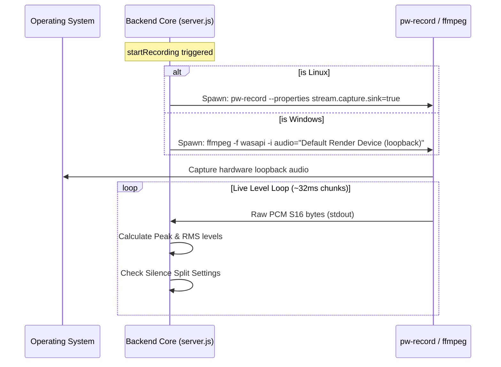

# WaveSentry

WaveSentry is a high-performance, professional desktop audio dashboard designed to **monitor and record system audio output channels** on both Linux and Windows. Packageable as a native desktop application using Electron, it captures loopback system audio directly from your sound card, visualizes levels in real-time, and features silence detection to split tracks automatically.

---

## ✨ Features

*   **Native Cross-Platform Audio Capture**:
    *   **Linux (PipeWire)**: Interacts natively with `pw-record` and `pw-dump` to capture mixed output from audio sinks (speakers/headphones) with zero microphone leakage.
    *   **Windows (WASAPI)**: Integrates with `ffmpeg` loopback recording to capture render output streams natively (bypassing the need for virtual cables or "Stereo Mix" settings).
*   **Silence Detection & Auto-Split**:
    *   Set custom threshold ($dB$) and duration ($seconds$) values.
    *   Automatically closes and saves the active recording WAV file when silence is detected, transitioning into an `Armed` state.
    *   Resumes recording into a new timestamped file automatically as soon as sound begins playing again.
*   **Low-Latency Studio Visualizers**:
    *   Sleek stereo LED VU meters displaying Peak & RMS values, complete with slow decay fallbacks resembling physical hardware.
    *   Real-time scrolling waveform canvas illustrating amplitude history.
    *   Monospaced segment clock displaying recording durations or `WAITING` status.
*   **Custom Audio Playback Library**:
    *   Lists captured audio files with file details (size, duration, creation dates).
    *   Features a custom-styled seekable audio player, allowing you to instantly play, download, or delete recordings from the local library.

---

## 📁 Repository Structure

```text
wavesentry/
├── public/                 # Frontend Web Assets
│   ├── index.html          # Semantic HTML5 Dashboard Structure
│   ├── style.css           # Premium Dark-Carbon Glassmorphic Theme
│   └── app.js              # WebSockets, VU Meter Decay, and Player Controller
├── src/                    # Backend Source Files
│   ├── server.js           # Express/WebSocket Audio Streaming & Recording Core
│   └── main-electron.js    # Electron Window Lifecycle Entrypoint
├── recordings/             # Saved High-Fidelity WAV Files (Local-only)
├── package.json            # Electron-Builder Configurations & Scripts
└── README.md               # Project documentation
```

---

## 🚀 Getting Started

### 📋 Prerequisites
*   **Node.js**: Version 16 or newer.
*   **FFmpeg** (For Windows or custom Linux capture): Ensure `ffmpeg` is installed and available in your system `PATH`.
*   **PipeWire** (For Linux): Standard on modern Linux distros (Ubuntu 22.04+, Fedora, Arch).

### 🛠️ Installation
Clone the repository and install npm dependencies:
```bash
npm install
```

### 💻 Running the App

*   **Development Mode (Server Only)**:
    Runs the Express backend and serves the frontend locally at `http://localhost:3000`:
    ```bash
    npm start
    ```
*   **Desktop App Mode (Electron)**:
    Launches the application inside a native Electron desktop window wrapper:
    ```bash
    npm run electron
    ```

### 📦 Compiling Desktop Installers
WaveSentry uses `electron-builder` to package the app into single-file installers. 

To package the application for your host system:
```bash
npm run build
```

This compiles target binaries into the `dist/` directory:
*   **Linux**: Compiles to `.deb` package installer and `.AppImage` portable bundle.
*   **Windows**: Compiles to a portable `.zip` archive containing `WaveSentry.exe` (can build a native `.exe` installer when built on a Windows host).

---

## 📈 System Sequence Flow



---

## ⚙️ Silence Auto-Split Logic

```
   [Record Button Triggered]
              │
              ▼
   Is Audio Active?
    ├── Yes ──> [Start WAV File] ──> [Recording Audio]
    │                                       │
    │                                       ▼
    │                              Silence Detected?
    │                               ├── Yes (>= 1.0s) ──> [Stop WAV File] ──> [Enter Armed State]
    │                               └── No ───────────────────────────────────────────┘
    │
    └── No ───> [Enter Armed State (WAITING)]
                       │
                       ▼
                 Audio Resumes?
                    ├── Yes ──> [Start New WAV File] ──> [Recording Audio]
                    └── No ──────────────────────────────────┘
```

---

## 📝 License & Authors
Created by **Paul Kircher** (`pkircher@gmail.com`). 
Licensed under the MIT License.
